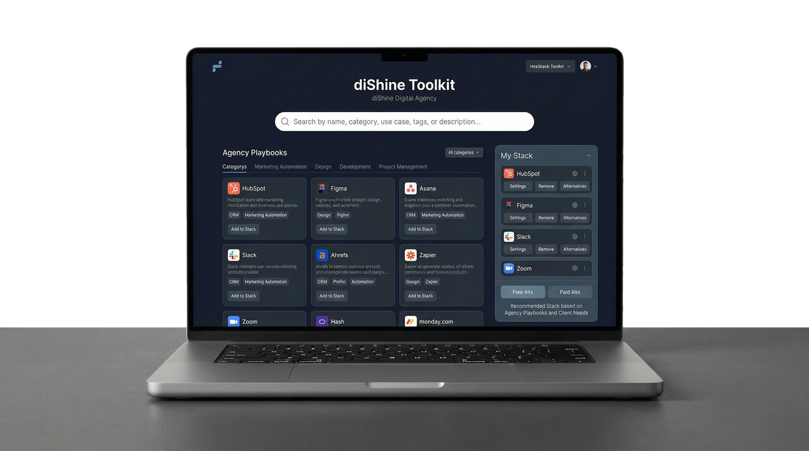
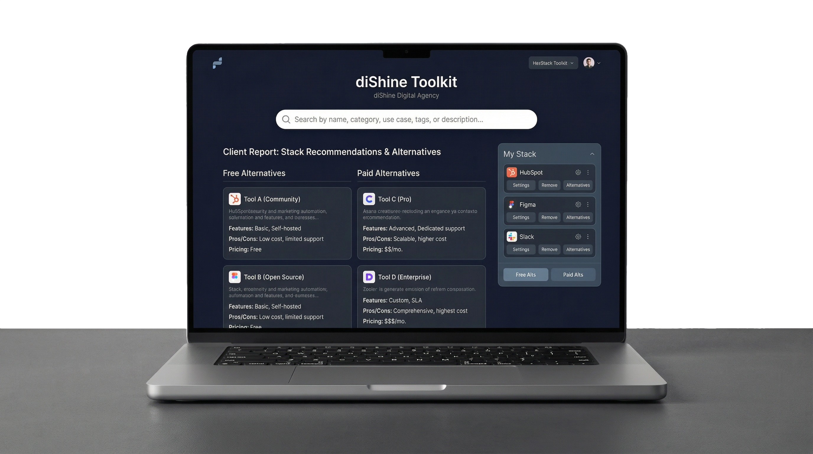
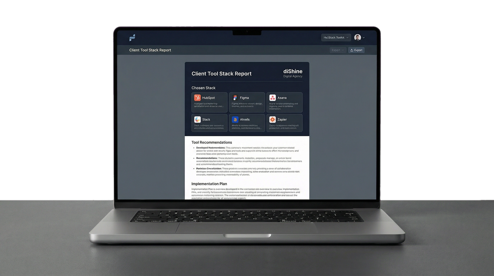

# 📚 TechStack Toolkit: 426 curated tools, smart utility-based matching and full-stack exports in PDF, Markdown, and TXT

<div align="center">
  
[](https://dishine.it/)

***Transform. Automate. Shine!***

[](https://dishine.it/)
[](https://linkedin.com/company/100682596)
[]()
[](LICENSE)

<p align="center">
  
</p>

*A client-ready toolkit for agencies, consultants, and digital teams. Browse the directory, build a stack, compare free and paid alternatives, and export a branded recommendation pack prepared as diShine Digital Agency.*

Built by [diShine Digital Agency](https://dishine.it).

</div>

<p align="center">
  
  
</p>

---

## 📖 Documentation

| Document | Description |
|----------|-------------|
| [GUIDE.md](GUIDE.md) | End-user guide — browsing, stacking, exporting |
| [CONTRIBUTING.md](CONTRIBUTING.md) | How to add tools, field reference, and matching tips |
| [ALGORITHM.md](ALGORITHM.md) | Technical reference for the matching engine scoring and thresholds |
| [DIRECTORY.md](DIRECTORY.md) | Static Markdown listing of all 426 tools with metadata and statistics |
| [changelog.md](changelog.md) | Release notes and version history |

---

## What ships now

- **Utility-first matching engine** that prioritizes the same use-case before broader same-category fallbacks
- **Full stack exports** with the chosen stack, free alternatives, and paid alternatives in every file
- **Timestamped filenames** on exports (`diShine-tool-stack-YYYY-MM-DD.pdf`) to prevent overwrites
- **Branded outputs** in **PDF**, **Markdown**, and **TXT** with an in-browser **Preview**
- **9 Agency Playbooks** — pre-built tool stacks for marketing, productivity, video, design, AI, e-commerce, privacy, bootstrap delivery, and content
- **Subcategory filter** — dropdown to filter by any of the 63 subcategories for faster discovery
- **Shared runtime logic** across the Astro app, standalone HTML build, and regression tests
- **Documentation integrity checks** (`npm run lint:docs`) to prevent drift between data and docs
- **Improved stack UX** with pricing filters, clearer stack state, reset support, and report preview

---

## Run locally

```bash
npm install
npm run build
npm test
npm run build:standalone
```

### Available scripts

| Command | Purpose |
|---|---|
| `npm run dev` | Start the Astro app locally |
| `npm run build` | Build the Astro app |
| `npm test` | Run matching and export regression checks |
| `npm run build:standalone` | Regenerate `standalone.html` |
| `npm run build:md` | Regenerate `DIRECTORY.md` with statistics |
| `npm run build:all` | Run standalone build, Markdown build, and tests in sequence |
| `npm run lint:docs` | Validate documentation references match the actual data |
| `npm run preview` | Preview the production build |

---

## Product behavior

### Stack builder

- Add any tool to **My Stack**
- Switch between **Chosen stack**, **Free alternatives**, and **Paid alternatives** views
- Reset back to the original hand-picked selection at any time
- Add optional client notes before export

### Agency Playbooks

Pre-built tool stacks for common delivery scenarios are available on the main page. Each playbook includes a curated set of tools that work well together for a specific workflow:

- **The Privacy Tech Stack** — analytics and tracking without cookie banners
- **The Bootstrap Delivery Stack** — launch an agency site for $0
- **Modern Content Engine** — SEO optimized content lifecycle
- **The Marketing Powerhouse** — full-funnel marketing from SEO to email automation
- **Agency Productivity Suite** — project management, docs, and team communication
- **Video Production Pipeline** — end-to-end video creation from capture to publish
- **Design & Brand Identity** — UI design, prototyping, and brand asset creation
- **AI-Powered Agency** — leverage AI across writing, code, and creative tasks
- **E-Commerce Launchpad** — build, manage, and grow an online store

### Export package

Every export includes:

1. **Chosen Stack**
2. **Free Alternatives**
3. **Paid Alternatives**

The report is generated with diShine branding and can be delivered as:

- **Preview** — view the branded HTML report in-browser before downloading
- **PDF** — branded downloadable report (`diShine-tool-stack-YYYY-MM-DD.pdf`)
- **Markdown** — easy to paste into proposals, docs, and Notion
- **TXT** — clean plain-text handoff

Export filenames include a date stamp to prevent file overwrites when generating multiple reports.

### Matching rules

The engine only searches inside the **same category**, then strongly prioritizes the **same subcategory / utility cluster**. If no strong match exists, it returns no recommendation instead of forcing a weak one.

For the technical details, see [ALGORITHM.md](ALGORITHM.md).

---

## Project structure

### Application

- `src/pages/index.astro` — main Astro experience
- `src/components/ToolCard.astro` — tool card UI
- `src/layouts/Layout.astro` — shared HTML layout with header and footer
- `src/styles/global.css` — global stylesheet
- `src/lib/toolkit-core.js` — shared matching, report, PDF, and HTML helpers
- `src/lib/toolkit-app.js` — shared browser-side stack behavior

### Data

- `src/data/tools.json` — tool dataset (426 entries)
- `src/data/stacks.json` — Agency Playbook definitions (9 playbooks)

### Build & test

- `build-standalone.js` — standalone HTML generator
- `build-md.js` — DIRECTORY.md generator (with statistics header)
- `test.js` — regression checks for matching, exports, and alternativeTo validation
- `lint-docs.js` — documentation integrity checker

### Generated outputs

- `standalone.html` — generated single-file delivery build
- `DIRECTORY.md` — generated Markdown tool directory with statistics

### Documentation

- `README.md` — project overview (this file)
- `GUIDE.md` — end-user guide for browsing, stacking, and exporting
- `CONTRIBUTING.md` — contributor guide with field reference and tips
- `ALGORITHM.md` — matching engine technical reference
- `changelog.md` — release notes

### Utilities

- `parse.js` — data parsing helpers
- `add-fmhy.js` / `add-fmhy-bulk.js` — import helpers for external tool lists

---

## Dataset

- **426 tools** across **21 categories** and **63 subcategories**
- **11 agency picks** (curated top recommendations)
- **46 curated `alternativeTo` relationships** for direct competitor matching
- Pricing distribution: 89 free · 106 open-source · 92 freemium · 139 paid
- Structured metadata for category, subcategory, pricing, tags, learning curve, and curated relationships

---

## License

Built and maintained by [diShine Digital Agency](https://dishine.it). Licensed under the [CC0 1.0 Universal](LICENSE) license.

---

## About diShine

[diShine](https://dishine.it) is a creative tech agency based in Milan. We create digital strategies, design process and build tools for clients, help businesses with AI strategy and MarTech architecture, and open-source some things we wish existed.

- Web: [dishine.it](https://dishine.it)
- GitHub: [github.com/diShine-digital-agency](https://github.com/diShine-digital-agency)
- Contact: kevin@dishine.it

